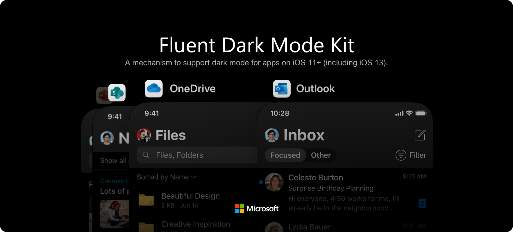

[](https://github.com/Carthage/Carthage)

FluentDarkModeKit was designed and developed before Apple‘s official dark mode release. It provides a mechanism to support dark mode for apps on iOS 11+ (including iOS 13).

## Features

- [x] Dark Mode support for iOS 11+
- [x] Dynamic theme change within the app without restart
- [x] Simple API design with minimal changes to your existing code

## Installation

### Requirements

- iOS 11.0+
- Xcode 11.0+
- Swift 5.0+
- Git LFS

You can use Homebrew to install Git LFS:

```
brew install git-lfs
```

### Carthage

To integrate FluentDarkModeKit into your Xcode project using Carthage, specify it in your `Cartfile`:

```
github "microsoft/FluentDarkModeKit"
```

### Swift Package Manager

Click "Files -> Swift Package Manager -> Add Package Dependency..." in Xcode's menu and search "https://github.com/microsoft/FluentDarkModeKit"

Since Xcode uses its own tools to handle swifft packages, git-lfs might not be picked up if it is installed via Homebrew. Run the following command to create a symbolic link if Xcode fails to fetch the package:

```
ln -s /usr/local/bin/git-lfs $(xcode-select -p)/usr/bin/git-lfs
```

### CocoaPods

To integrate FluentDarkModeKit into your Xcode project using CocoaPods, specify it in your `Podfile`:

```
pod "FluentDarkModeKit"
```

## Get Started

### How to Set Up FluentDarkModeKit

To set up FluentDarkModeKit, you need to call the following methods first.

```swift
let configuration = DMEnvironmentConfiguration()
configuration.themeChangeHandler = {
    print("theme changed")
}
configuration.windowThemeChangeHandler = { window in
    print("\(window) theme changed")
}
configuration.useImageAsset = false

DarkModeManager.setup(with: configuration)
DarkModeManager.register(with: UIApplication.shared)
```

There are 3 configurable properties in FluentDarkModeKit as you can see in the code sample above.

**themeChangeHandler**

This is a callback for app wide theme change. Defaults to nil.

It is invoked when a new theme is set via `setOverrideTraitCollection(_:)` or system wide theme changes (`DMTraitCollection.overrideTraitCollection.userInterfaceStyle` is set to `.unspecific`).

**windowThemeChangeHandler**

This is a callback for window theme change. iOS 13+. Defaults to nil.

It is invoked per window when the window's `traitCollection.userInterfaceStyle` changes.
UIWindow's `traitCollection.userInterfaceStyle` can change for multiple reasons:
1. System wide theme changes (`DMTraitCollection.overrideTraitCollection.userInterfaceStyle` and UIWindow's `overrideUserInterfaceStyle` are both `.unspecific`).
2.  `setOverrideTraitCollection(_:)`  is called (UIWindow's `overrideUserInterfaceStyle` is `.unspecific`).
3. UIWindow's `overrideUserInterfaceStyle` is manually modified to a different value than current mode.
4. UIKit modifies your UIWindow's `traitCollection` (An example would be when an app enters background, UIKit will prepare snapshots with dark mode on/off by modifying it).

**useImageAsset**

It determines whether UIImageAsset is used for dynamic image. iOS 13+. Defaults to false.

Images marked with "Preserve Vector Data" must not to be used when it is set to true.

### How to Use FluentDarkModeKit

To use FluentDarkModeKit, provide a pair of colors or images instead of a single value. Simply replace existing colors/images with a pair of light and dark colors/images.

#### Colors

```swift
extension UIColor {
    init(_ namespace: DMNamespace, light: UIColor, dark: UIColor)
    init(_ namespace: DMNamespace, dynamicProvider: @escaping (DMTraitCollection) -> UIColor)
}

let color1 = UIColor(.dm, light: .white, dark: .black)
let color2 = UIColor(.dm) { traitCollection in
    return traitCollection.userInterfaceStyle == .dark ? UIColor.black : UIColor.white
}
```

#### Images

```swift
extension UIImage {
    init(_ namespace: DMNamespace, light: UIImage, dark: UIImage)
}

let lightImage = UIImage(named: "Light")!
let darkImage = UIImage(named: "Dark")!
let image = UIImage(.dm, light: lightImage, dark: darkImage)
```

#### Change Theme

```swift
DMTraitCollection.setOverride(DMTraitCollection(userInterfaceStyle: .light), animated: true) // Change to light theme with animation
DMTraitCollection.setOverride(DMTraitCollection(userInterfaceStyle: .unspecified), animated: true) // Change to "follow system" theme
```

### Others

For more complex scenarios, FluentDarkModeKit is similar to what Apple does in iOS 13 (some slight differences). It maintains a global `DMTraitCollection` which can be accessed through `DMTraitCollection.current` during custom layout. 

For more information on cases you should handle during layout, please refer to [Apple's documentation](https://developer.apple.com/documentation/xcode/supporting_dark_mode_in_your_interface#2993898).

FluentDarkModeKit will notify views or view controllers in the current window when the theme changes by calling the following delegate method. 

```swift
protocol DMTraitEnvironment: NSObjectProtocol {
    func dmTraitCollectionDidChange(_ previousTraitCollection: DMTraitCollection?)
}
```

## Migration

If you are using a pre 0.5.2 version and wants to migrate to the new version, here are the changes that you should pay attention to:

1. On iOS 13, the latest version of FluentDarkModeKit uses iOS 13's API for dynamic color and theme change.
2. There are some API changes, see [How to Set Up FluentDarkModeKit](#how-to-set-up-fluentdarkmodekit) and [Change Theme](#change-theme).

Carefully test your app after updating FluentDarkModeKit and fix compile errors/warnings.


## Contributing

This project welcomes contributions and suggestions. Most contributions require you to agree to a
Contributor License Agreement (CLA) declaring that you have the right to, and actually do, grant us
the rights to use your contribution. For details, visit https://cla.opensource.microsoft.com.

When you submit a pull request, a CLA bot will automatically determine whether you need to provide
a CLA and decorate the PR appropriately (e.g., status check, comment). Simply follow the instructions
provided by the bot. You will only need to do this once across all repos using our CLA.

This project has adopted the [Microsoft Open Source Code of Conduct](https://opensource.microsoft.com/codeofconduct/).
For more information see the [Code of Conduct FAQ](https://opensource.microsoft.com/codeofconduct/faq/) or
contact [opencode@microsoft.com](mailto:opencode@microsoft.com) with any additional questions or comments.

## License

Copyright (c) Microsoft Corporation. All rights reserved.

Licensed under the [MIT](LICENSE) license.
